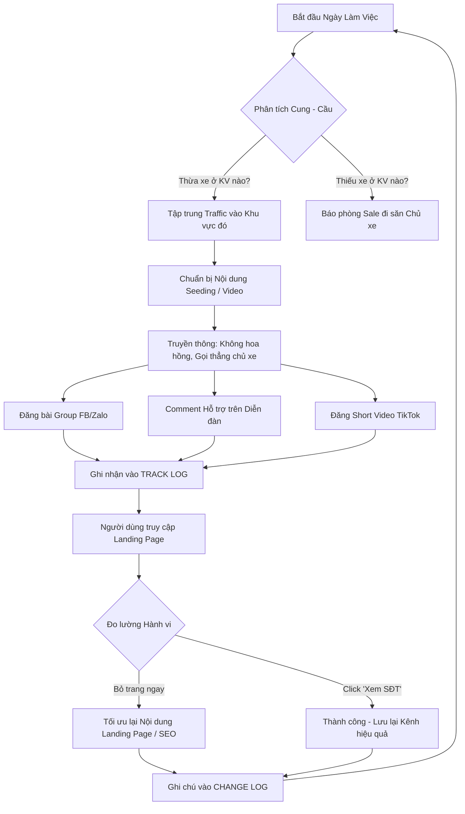

# WORKFLOW PHÒNG MARKETING: CHIẾN DỊCH ZERO-COST & 100 KHÁCH ĐẦU TIÊN

Quy trình chuẩn (Workflow) này quy định cách thức phòng Marketing vận hành hàng ngày để kéo traffic và tỷ lệ chuyển đổi khách thuê xe, đảm bảo sự phối hợp nhịp nhàng với phòng Sale và tuân thủ nguyên tắc cốt lõi của dự án Thuê Xe Nhanh.

## Sơ đồ luồng công việc (Workflow Diagram)

## Chi tiết các bước (Standard Operating Procedure - SOP)

### Bước 1: Đồng bộ Cung - Cầu (Mỗi Sáng)
- **Check Cung:** Xem hệ thống hiện tại đang có nhiều xe trống ở địa phương nào (VD: Đà Lạt).
- **Check Cầu:** Xem từ khóa tìm kiếm hoặc lịch sử tìm kiếm rỗng ở khu vực nào (VD: Vũng Tàu không có xe). Nếu có, ping ngay cho phòng Sale để đẩy mạnh tìm nguồn.
- **Quyết định:** Chọn khu vực mục tiêu để chạy chiến dịch Zero-cost trong ngày.

### Bước 2: Lên Kịch Bản & Thông Điệp
- Tuân thủ nguyên tắc: **Không hứa hẹn "Đặt xe ngay"**.
- Key message cố định: *"Nền tảng tìm xe không phí ẩn - Lấy số điện thoại gọi trực tiếp để ép giá chủ xe"*.
- Chuẩn bị tài nguyên (ảnh, text) sao cho tự nhiên nhất (góc nhìn người dùng chia sẻ mẹo, hoặc admin giới thiệu thẳng thắn).

### Bước 3: Triển Khai Thực Tế
- Rải bài vào các cộng đồng mục tiêu.
- **BẮT BUỘC:** Mọi bài đăng, comment dạo đều phải lấy link và ghi chép vào bảng `TRACK LOG` tại file `01-MARKETING.md`.

### Bước 4: Đo Lường & Tối Ưu (Cuối Ngày/Tuần)
- Kiểm tra lại lượng click từ các nguồn đã đăng (Nếu có gắn UTM link càng tốt).
- Nếu tỷ lệ người dùng thoát ngay (Bounce rate) cao $\rightarrow$ Cần xem lại giao diện/nội dung trang đích (Landing Page) có đang bị hiểu nhầm không.
- Nếu chiến lược nội dung phải thay đổi $\rightarrow$ Ghi ngay vào `CHANGE LOG`.
- Dọn dẹp và backup tài nguyên ảnh/video cũ vào `_backup/marketing/`.
